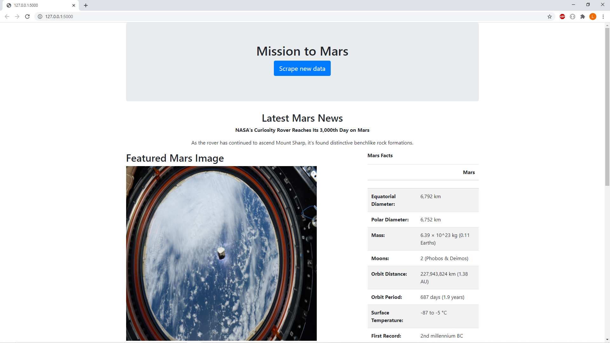
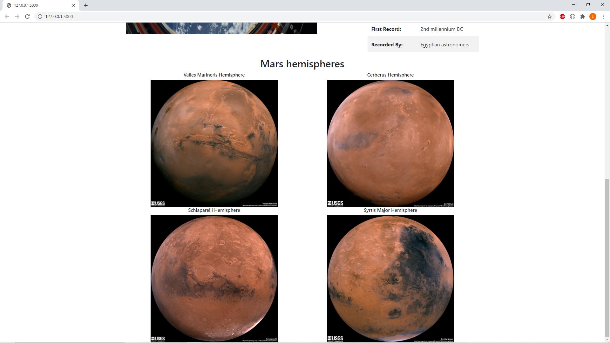

# Web_Scraping_Challenge

## Table of Contents
* [Introduction](#introduction)
* [Technologies](#technologies)

## Introduction
Build a web application that scrapes various websites for data related to the Mission to Mars and display that information in a single HTML page. 

## Technologies
* HTML
* BeautifulSoup
* Splinter
* Pymongo
* Flask

